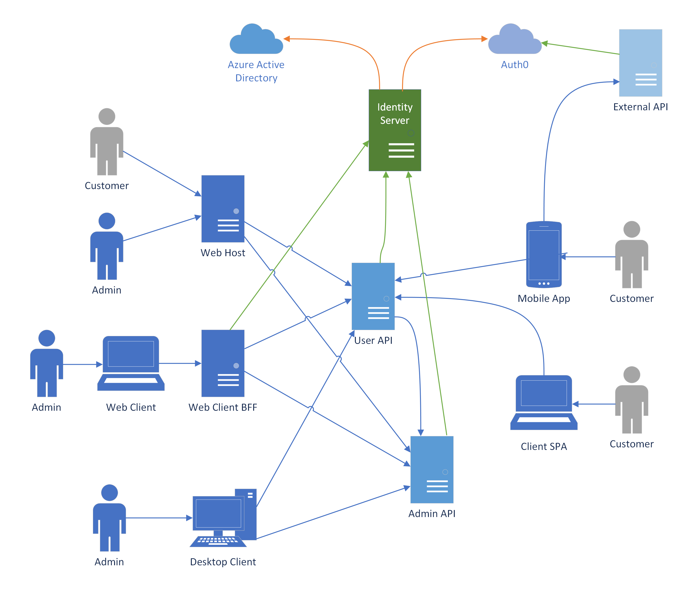

# Demo code for "Secure Identity in Heterogenous Application Environments"

## Microsoft Azure + AI Conference Fall 2022, presented by John Bowen

The demo system is a very simple Notes application with multiple clients for individual users and admins implemented across separate systems that communicate using OIDC and OAuth standards. This repo contains all related components of the system as shown in this diagram, with the exception of public cloud hosted services (Azure Active Directory, Auth0):

## Components 
Code is broken out into 3 Visual Studio 2022 solutions containing .NET 6 projects and an additional React app folder. Components are generally built using standard templates with minimal modifications focused on identity features and very basic application functionality. In most cases launchsettings and appsettings configurations are set up to link projects together but with some missing secret values left blank. Most secret values can be found in [Config.cs](/src/Identity/IdentityServer/Config.cs) and can be added in place or in Visual Studio User Secrets. AAD and Auto0 settings will need to come from your own tenant if using.

- [Demo.Notes.Identity.sln](/src/Identity/) solution
    - Duende Identity Server 6
        - IdentityServer project
- [Demo.Notes.Web.sln](/src/Web/) solution
    - MVC Web Application
        - Demo.Notes.Web.Host project
        - Customer and Admin login
    - Blazor WASM Web Client
        - Demo.Notes.Web.Blazor.Client project
        - Admin login only
    - Blazor BFF Web Host
        - Demo.Notes.Web.Blazor.Server project
        - YARP reverse proxy to internal APIs
    - User API
        - Demo.Notes.Web.UserApi.Host project
        - Customer facing endpoints
    - Admin API
        - Demo.Notes.Web.AdminApi.Host project
        - Endpoints for internal Admin users and systems
    - External API
        - Demo.Partner.ExternalApi.Host project
        - Represents third party API using external auth
- [Demo.Notes.Client.sln](/src/Client/) solution
    - WPF Desktop Client
        - Demo.Notes.Client.Desktop project
        - Admin login only
    - .NET MAUI Mobile Client
        - Demo.Notes.Client.Mobile project
        - Customer login only including external Auth0 Customer users
- [notes-client](/src/SPA/notes-client/) folder
    - React SPA Client
        - Customer login only
- [User Data](/data/TestUsers.json)
    - JSON file containing all user data
    - Used in lieu of a database for simplicity
    